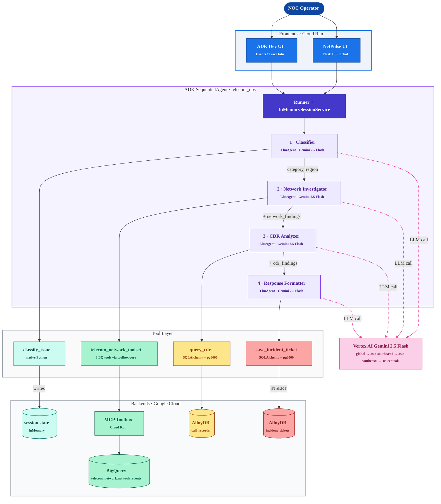

<div align="center">

# NetPulse AI

[](https://www.python.org/downloads/)
[](https://google.github.io/adk-docs/)
[](https://cloud.google.com/vertex-ai)
[](https://cloud.google.com/run)
[](#)

**A multi-agent AI assistant that automates the first-response workflow for telecom Network Operations Center (NOC) teams. One natural-language complaint in, one structured incident ticket out, all in 25-30 seconds.**

**Try it live:** [NetPulse UI](https://netpulse-ui-486319900424.us-central1.run.app) (primary) · [Telecom Ops Assistant](https://telecom-ops-assistant-486319900424.us-central1.run.app) (fallback)

[Demo](#demo) · [Architecture](#architecture) · [How It Works](#how-it-works) · [Getting Started](#getting-started) · [Deployment](#deployment)

</div>

---

## Table of Contents

- [Overview](#overview)
- [Demo](#demo)
- [Features](#features)
- [Tech Stack](#tech-stack)
- [Architecture](#architecture)
- [How It Works](#how-it-works)
- [Getting Started](#getting-started)
- [Project Structure](#project-structure)
- [Deployment](#deployment)
- [Configuration](#configuration)
- [Observability](#observability)
- [Lessons & Trade-offs](#lessons--trade-offs)
- [Author](#author)
- [Acknowledgments](#acknowledgments)

---

## Overview

NetPulse AI was built for the **Gen AI Academy APAC Edition 2026** hackathon as a working prototype of how multi-agent orchestration can replace the manual cross-system lookups NOC engineers do dozens of times a day.

When a customer reports something like *"Major dropped calls in Surabaya"*, a NOC operator today has to query at least three independent systems, namely a network event database, a call detail records (CDR) database, and a ticketing system, and manually correlate the results. NetPulse AI does all of that in a single natural-language step:

1. **Classifies** the complaint into a category (network / billing / hardware / service / general) and a region.
2. **Investigates** live network events from BigQuery via MCP Toolbox.
3. **Analyzes** matching call detail records from AlloyDB.
4. **Synthesizes** an incident ticket with a NOC recommendation, persisted to AlloyDB and surfaced to the operator.

The whole workflow runs as a Google ADK `SequentialAgent` orchestrating four `LlmAgent` sub-agents, each backed by Gemini 2.5 Flash on Vertex AI. End-to-end latency is **25-30 seconds** including all four LLM calls and three live database round-trips.

## Demo

### Live deployments

Both services are running on Cloud Run:

| Service | Role | URL |
|---|---|---|
| **NetPulse UI** | Hackathon primary, custom branded chat experience | https://netpulse-ui-486319900424.us-central1.run.app |
| **Telecom Ops Assistant** | Fallback, ADK Dev UI with `/events` and `/trace` observability tabs | https://telecom-ops-assistant-486319900424.us-central1.run.app |

### NetPulse UI: custom Flask chat interface

The primary demo surface. A free-text complaint at the top, four pipeline cards below showing each sub-agent in real time (status, tool calls, output text), carry-over labels showing exactly which session-state keys flow forward to the next agent, and a final dark Incident Report card at the bottom. Streamed via Server-Sent Events.


### Use case diagram

The end-to-end workflow from operator complaint to persisted incident ticket.


### ADK Dev UI: Trace tab

Built-in observability that comes with `adk deploy cloud_run --with_ui`. Every LLM call, tool invocation, prompt, and response is captured as a span with millisecond timing.


### ADK Dev UI: Events tab

Streaming sub-agent conversation showing each `LlmAgent` taking its turn, calling its tool, and producing its `output_key` for the next agent.


## Features

- **Multi-agent orchestration.** Google ADK 1.14 `SequentialAgent` chaining four `LlmAgent` sub-agents with explicit session-state hand-off via `output_key`. Not multi-tool inside one big agent, but four specialized agents each owning one responsibility.
- **Cross-source evidence correlation.** Automatically links BigQuery network events with AlloyDB CDR rows to surface root causes (e.g., a dropped call from cell tower JKT-002 correlated with the major fiber cut event EVT001).
- **Persistent structured output.** Every run inserts an auditable row in AlloyDB `incident_tickets` with category, region, related events, CDR findings, and a NOC recommendation. Queryable, joinable, archivable, not a transient chat response.
- **Two frontends, one engine.** A custom NetPulse UI (Flask + Server-Sent Events) for branded demo, plus the built-in ADK Dev UI (`/events` + `/trace` tabs) for free observability. Both call the same `Runner + InMemorySessionService + root_agent`.
- **APAC-optimized inference with region failover.** Vertex AI Gemini 2.5 Flash defaults to the `global` multi-region pool, then fails over per-LlmAgent through `asia-southeast2` → `asia-southeast1` → `us-central1` on `RESOURCE_EXHAUSTED`. Each agent walks the ladder independently, so one agent's quota miss does not bind the others. Implementation in `telecom_ops/vertex_failover.py`.
- **Boot-resilient by design.** MCP Toolbox client wrapped in `try/except`, AlloyDB engine uses `pool_pre_ping=True` + `pool_recycle=300` to survive idle-connection reaping, agent runner is lazy-loaded so frontend tabs that don't need the agent stay functional even if the toolbox is cold.
- **Validated end-to-end.** 32 incident tickets created across 5 Indonesian regions and 3 issue categories during pre-submission stress testing. Zero `429 RESOURCE_EXHAUSTED` errors after the asia-southeast1 region switch.

## Tech Stack

| Component | Technology | Why |
|---|---|---|
| Agent framework | **Google ADK 1.14.0** | `SequentialAgent` + `LlmAgent` give built-in state management, `output_key` chaining, and the native function-calling tool protocol, all with zero glue code |
| LLM | **Gemini 2.5 Flash on Vertex AI** | Best latency/cost for APAC; Vertex AI bypasses Google AI Studio rate limits |
| Inference region | **`global` with ranked failover** | Default to Google's multi-region pool (`global`); on `RESOURCE_EXHAUSTED`, fail over through `asia-southeast2` → `asia-southeast1` → `us-central1`. Per-LlmAgent failover state in `telecom_ops/vertex_failover.py`. |
| Tool gateway | **MCP Toolbox for Databases** (Cloud Run) | Direct BigQuery MCP returns 403 on Cloud Run; Toolbox is the proven ADK-compatible bridge |
| Analytical store | **BigQuery** (`telecom_network.network_events`) | 30-row dataset of outages, maintenance, degradations, restorations across 5 Indonesian cities |
| Operational store | **AlloyDB for PostgreSQL 17** | Hosts `call_records` (50 rows of CDR data) and `incident_tickets` (persistent agent output) |
| Operational store driver | **SQLAlchemy 2 + pg8000** | Pure-Python wire driver, works in Cloud Run without C extensions |
| Custom UI | **Flask 3 + Server-Sent Events** | Streams ADK events into animated chat cards; uses `fetch()` + `ReadableStream` (POST + SSE) |
| Async-to-sync bridge | **threading.Thread + queue.Queue** | Drains the async ADK Runner from a sync Flask request handler without buffering |
| Hosting | **Cloud Run** | Both the ADK Dev UI service and the Custom NetPulse UI service |
| Auth | **Application Default Credentials** | Vertex AI + BigQuery + AlloyDB all reuse the same gcloud ADC token |

## Architecture

The mermaid block below renders natively on GitHub. A pre-rendered PNG also lives at [`docs/architecture.png`](docs/architecture.png) for use in slides and offline viewing.



## How It Works

### The four sub-agents

| # | Agent | Tool | Backend | Session-state output |
|---|---|---|---|---|
| 1 | **Classifier** | `classify_issue` | in-memory only | `category`, `region`, `complaint`, `reasoning`, `classification` |
| 2 | **Network Investigator** | `telecom_network_toolset` (8 tools) | MCP Toolbox → BigQuery | `network_findings` |
| 3 | **CDR Analyzer** | `query_cdr` | AlloyDB `call_records` (read) | `cdr_findings`, `cdr_results` |
| 4 | **Response Formatter** | `save_incident_ticket` | AlloyDB `incident_tickets` (write) | `final_report`, `ticket_id` |

Each agent is an `LlmAgent` with:

- A long, explicit instruction (in `telecom_ops/prompts.py`) describing its role and the exact format of its output
- Defensive `{key?}` substitution syntax so a partial chain (e.g., upstream agent failed) still produces a graceful report instead of crashing on a `KeyError`
- An `output_key` that captures the agent's final text response into session state under a known name
- Exactly one tool, except the Network Investigator which loads an entire toolset from the MCP Toolbox

### Carry-over between sub-agents

The `SequentialAgent` runs each sub-agent in order, but the agents communicate through `session.state`, not through return values. The carry-over set is exactly what each downstream agent's instruction template references:

```
1. Classifier            → writes: complaint, category, region, reasoning, classification
                                   ↓
2. Network Investigator  → reads: category, region          → writes: network_findings
                                   ↓
3. CDR Analyzer          → reads: category, region, network_findings   → writes: cdr_findings
                                   ↓
4. Response Formatter    → reads: classification, category, region, network_findings, cdr_findings
                         → writes: final_report, ticket_id
```

The custom NetPulse UI exposes these carry-over keys explicitly between cards so judges can see exactly which session-state values flow forward at each step.

### One example run

Input: *"Customer reports failed calls in Jakarta"*

| Step | Agent | What happens |
|---|---|---|
| 1 | Classifier (~3 s) | LLM picks `category=network`, `region=Jakarta` and writes them to session state |
| 2 | Network Investigator (~10 s) | LLM calls `query_events_jakarta` via MCP Toolbox; gets back 9 BigQuery rows including EVT001 (fiber cut, critical), EVT016 (degradation, minor), EVT024 (LTE congestion, major); summarizes |
| 3 | CDR Analyzer (~12 s) | LLM calls `query_cdr(region="Jakarta", status_filter="")`; gets 11 AlloyDB rows (7 completed, 3 dropped, 1 failed); correlates the failed call with EVT024 and the dropped calls with EVT001/EVT016 |
| 4 | Response Formatter (~5 s) | LLM calls `save_incident_ticket(...)`; AlloyDB returns `ticket_id=15`; emits the final structured INCIDENT REPORT |

End-to-end: **~30 seconds**, three database round-trips, zero human intervention.

## Getting Started

### Prerequisites

- Python 3.12+
- Google Cloud project with these APIs enabled: Vertex AI, BigQuery, AlloyDB, Cloud Run
- `gcloud` CLI configured: `gcloud auth login` AND `gcloud auth application-default login`
- AlloyDB cluster reachable (public IP for local dev or VPC connector for Cloud Run)
- BigQuery dataset `telecom_network.network_events` populated
- MCP Toolbox for Databases deployed to Cloud Run with the `telecom_network_toolset`

### Installation

```bash
git clone https://github.com/adityonugrohoid/hackathon-telecom-ops.git
cd hackathon-telecom-ops

python3 -m venv .venv
source .venv/bin/activate

# Install the agent package
pip install -r telecom_ops/requirements.txt

# Plus Flask for the custom UI
pip install flask gunicorn google-cloud-bigquery
```

### Configure the AlloyDB schema

```bash
python setup_alloydb.py
```

This creates the `incident_tickets` table (idempotent, safe to re-run).

### Run the ADK Dev UI locally

```bash
export GOOGLE_APPLICATION_CREDENTIALS=~/.config/gcloud/legacy_credentials/<your-account>/adc.json
adk web
```

Browse to `http://localhost:8000`, select `telecom_ops`, send a query.

### Run the custom NetPulse UI locally

```bash
cd netpulse-ui
export GOOGLE_APPLICATION_CREDENTIALS=~/.config/gcloud/legacy_credentials/<your-account>/adc.json
export GOOGLE_CLOUD_PROJECT=plated-complex-491512-n6
export GOOGLE_CLOUD_LOCATION=global
export GOOGLE_GENAI_USE_VERTEXAI=TRUE
export DATABASE_URL='postgresql+pg8000://postgres:<password>@<alloydb-public-ip>:5432/postgres'

python app.py
```

Browse to `http://localhost:8080`. Four tabs:

| Tab | What it shows | Backend |
|---|---|---|
| **Chat** | The streaming agent pipeline | ADK SequentialAgent |
| **Network Events** | Live BigQuery query of `network_events` | BigQuery |
| **Call Records** | Live AlloyDB query of `call_records` | AlloyDB read |
| **Incident Tickets** | Live AlloyDB query of `incident_tickets` | AlloyDB write target |

## Project Structure

```
hackathon-telecom-ops/
├── telecom_ops/                          # The ADK agent package (deployed to Cloud Run)
│   ├── __init__.py                       #   from . import agent
│   ├── agent.py                          #   4 LlmAgents + SequentialAgent root_agent
│   ├── tools.py                          #   classify_issue, query_cdr, save_incident_ticket + singletons
│   ├── prompts.py                        #   4 sub-agent instructions with {key?} state references
│   ├── .env                              #   GOOGLE_GENAI_USE_VERTEXAI=TRUE + region (gitignored)
│   └── requirements.txt                  #   google-adk==1.14.0 + toolbox-core + sqlalchemy + pg8000
│
├── netpulse-ui/                          # Custom Flask web UI (sibling deploy)
│   ├── app.py                            #   Flask routes + SSE plumbing + static .env loader
│   ├── agent_runner.py                   #   Bridges sync Flask to async ADK Runner via thread+queue
│   ├── data_queries.py                   #   Read-only BigQuery + AlloyDB queries for the data tabs
│   ├── templates/                        #   base.html, chat.html, network_events.html, ...
│   ├── static/style.css                  #   Centralized theme tokens at :root, color-mix() variants
│   ├── static/netpulse-logo.png          #   Logo asset (Flask static)
│   ├── requirements.txt                  #   flask + gunicorn + google-cloud-bigquery + ADK chain
│   └── Dockerfile                        #   python:3.12-slim + gunicorn
│
├── docs/                                 # Submission deck + screenshots + diagrams
│   ├── Prototype Submission Deck...pptx  #   Hack2Skill submission deck
│   ├── architecture.mmd                  #   Mermaid source for the system diagram
│   ├── architecture.png                  #   Pre-rendered architecture diagram
│   └── screenshots/                      #   ADK Dev UI + NetPulse UI captures
│
├── setup_alloydb.py                      # Idempotent DDL for incident_tickets
├── CLAUDE.md                             # Project context for AI coding assistants
└── README.md                             # This file
```

## Deployment

### ADK service (telecom_ops): deployed

```bash
gcloud config configurations activate gcp-personal   # personal account owns the project

uvx --from google-adk==1.14.0 \
adk deploy cloud_run \
  --project=plated-complex-491512-n6 \
  --region=us-central1 \
  --service_name=telecom-ops-assistant \
  --with_ui \
  telecom_ops \
  -- \
  --service-account=lab2-cr-service@plated-complex-491512-n6.iam.gserviceaccount.com \
  --set-env-vars="GOOGLE_GENAI_USE_VERTEXAI=TRUE,GOOGLE_CLOUD_PROJECT=plated-complex-491512-n6,GOOGLE_CLOUD_LOCATION=global"

# Background-run deploys silently answer N to the "allow unauthenticated" prompt; fix:
gcloud run services add-iam-policy-binding telecom-ops-assistant \
  --region=us-central1 \
  --member="allUsers" \
  --role="roles/run.invoker" \
  --project=plated-complex-491512-n6
```

| Resource | Value |
|---|---|
| Service | `telecom-ops-assistant` |
| Cloud Run region | `us-central1` |
| Vertex AI region | `asia-southeast1` (set via `GOOGLE_CLOUD_LOCATION` env var) |
| URL | `https://telecom-ops-assistant-486319900424.us-central1.run.app` |
| Service account | `lab2-cr-service@plated-complex-491512-n6.iam.gserviceaccount.com` |
| Public access | `allUsers` → `roles/run.invoker` |

### NetPulse UI service: deployed

The custom Flask UI deploys from the parent directory so the build context can include both `netpulse-ui/` and `telecom_ops/`. The parent-level `Dockerfile` copies both packages into the image, and `.gcloudignore` filters the build context to skip the venv, scratch directories, and the submission deck. VPC connector flags route the container to AlloyDB through the private IP.

| Resource | Value |
|---|---|
| Service | `netpulse-ui` |
| Cloud Run region | `us-central1` |
| Vertex AI region | `asia-southeast1` |
| URL | `https://netpulse-ui-486319900424.us-central1.run.app` |
| VPC | `easy-alloydb-vpc` / `easy-alloydb-subnet` |
| Public access | `allUsers` → `roles/run.invoker` |

## Configuration

All configuration is via environment variables (no `python-dotenv`; the agent package auto-loads `.env` from `telecom_ops/.env` and the Flask app uses a stdlib `_load_dotenv_stdlib` parser).

| Variable | Purpose | Default / example |
|---|---|---|
| `GOOGLE_CLOUD_PROJECT` | GCP project for Vertex AI + BQ + AlloyDB | `plated-complex-491512-n6` |
| `GOOGLE_CLOUD_LOCATION` | Vertex AI inference region (initial — failover ladder kicks in on 429) | `global` |
| `GOOGLE_GENAI_USE_VERTEXAI` | Force Vertex AI (vs Google AI Studio API key) | `TRUE` |
| `GOOGLE_APPLICATION_CREDENTIALS` | Path to ADC JSON for local runs | `~/.config/gcloud/legacy_credentials/<account>/adc.json` |
| `DATABASE_URL` | AlloyDB SQLAlchemy URL | `postgresql+pg8000://postgres:<pwd>@<ip>:5432/postgres` |

For local development, use the AlloyDB instance's public IP. For Cloud Run, override `DATABASE_URL` with the private IP and add VPC connector flags so the container can reach AlloyDB through the VPC.

## Observability

Two free observability surfaces come with the ADK deployment:

- **`/events`** streams the sub-agent conversation, including every `LlmAgent` turn, every tool call, and every state mutation
- **`/trace`** is a full timeline view with span timing for every LLM call and tool invocation

The custom NetPulse UI also exposes the SSE event stream at `POST /api/query` if you want to drive it programmatically. Each event is JSON-encoded with shape:

```
data: {"type": "agent_start", "agent": "classifier"}
data: {"type": "tool_call", "agent": "classifier", "tool": "classify_issue", "args": {...}}
data: {"type": "tool_response", "agent": "classifier", "tool": "classify_issue", "result": {...}}
data: {"type": "text", "agent": "classifier", "text": "Category: network..."}
...
data: {"type": "complete", "ticket_id": 32, "final_report": "INCIDENT REPORT..."}
```

## Lessons & Trade-offs

A handful of non-obvious decisions worth surfacing:

- **MCP Toolbox vs direct BigQuery MCP.** The endpoint `https://bigquery.googleapis.com/mcp` returns 403 / connection-closed when called from a Cloud Run-hosted ADK agent. The MCP Toolbox for Databases (a small Cloud Run service that wraps a `tools.yaml` of parameterized SQL queries) is the proven workaround. We use 8 toolset entries: five per-region `query_events_<city>` tools plus `query_critical_outages`, `query_affected_customers_summary`, and `query_network_events`.
- **Vertex AI region matters for APAC, and a single pinned region is fragile.** `us-central1` is the default Vertex AI region, but it's also the most contested Dynamic Shared Quota (DSQ) pool. During the APAC hackathon, a baseline query that worked at 3 a.m. would 429 at 9 a.m. local time as US developers came online. Switching to `asia-southeast1` eliminated 429s entirely across 32 sequential test queries — but a single trial-billing project on a single region has no headroom if that region ever spikes. The refinement-phase fix replaces the static pin with a `global` default plus a ranked failover ladder (`asia-southeast2` → `asia-southeast1` → `us-central1`); each `LlmAgent` walks the ladder independently, so failure becomes one extra hop instead of a hard 500. See `telecom_ops/vertex_failover.py`.
- **Async ADK Runner ↔ sync Flask.** `runner.run_async()` is async-only, but Flask is sync. The naive `asyncio.run()` wrapper buffers all events into a list before yielding the first byte, breaking the chat-card animation. The fix in `netpulse-ui/agent_runner.py` is a per-request worker thread running its own asyncio loop and pushing converted events onto a `queue.Queue` that the SSE generator drains in real time.
- **Eager-init singletons.** The agent's `tools.py` instantiates the MCP Toolbox client and the AlloyDB engine at module import. The toolbox client is wrapped in `try/except` (so the agent boots even if the toolbox is cold). The AlloyDB engine uses `pool_pre_ping=True` + `pool_recycle=300` to survive connection-pool staleness when the dev box goes idle for 30+ minutes between demos.
- **Defensive prompt substitution.** All cross-agent state references in `prompts.py` use ADK's `{key?}` optional syntax. If an upstream agent fails before populating its `output_key`, downstream agents still get a graceful empty string instead of crashing on a `KeyError` during instruction formatting.
- **Two frontends, one engine.** The ADK Dev UI gives free `/events` and `/trace` tabs. Building a custom UI doesn't replace it; it complements it. The NetPulse UI is the *demo* surface (branded, animated, narrated); the ADK Dev UI is the *debug* surface (every span, every value).

## Author

**Adityo Nugroho** ([@adityonugrohoid](https://github.com/adityonugrohoid))

Built for the **Gen AI Academy APAC Edition 2026** hackathon.

## Acknowledgments

- [Google Agent Development Kit](https://google.github.io/adk-docs/), the orchestration framework that made the four-agent chain expressible in ~50 lines of Python
- [MCP Toolbox for Databases](https://googleapis.github.io/genai-toolbox/), the bridge that makes BigQuery callable from ADK agents on Cloud Run
- [Vertex AI Gemini 2.5 Flash](https://cloud.google.com/vertex-ai), fast, cheap, available in `asia-southeast1`
- [AlloyDB for PostgreSQL](https://cloud.google.com/alloydb), wire-compatible Postgres with managed scaling, queryable from local dev via public IP and from Cloud Run via VPC connector
