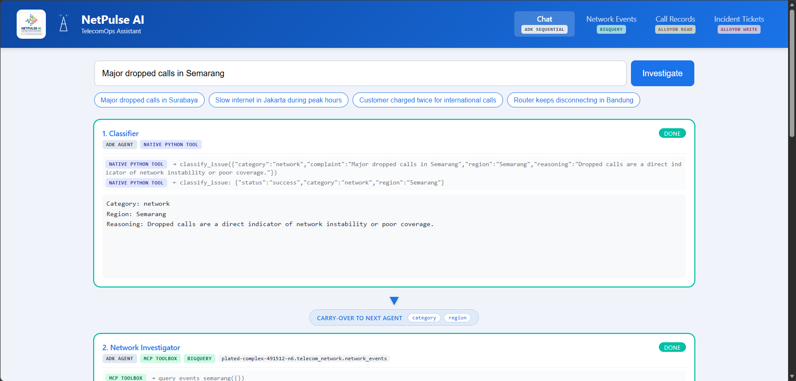
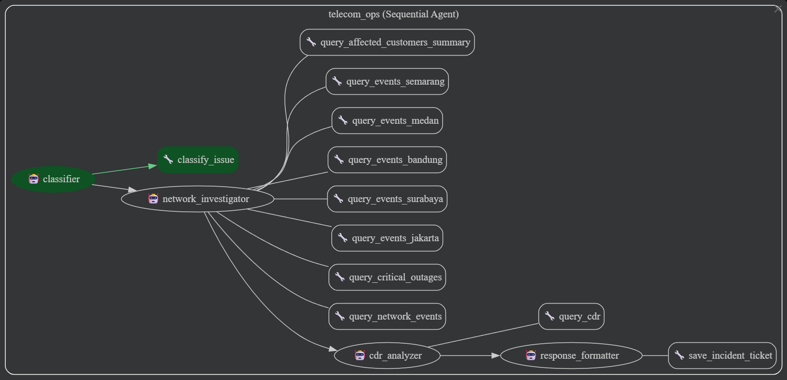
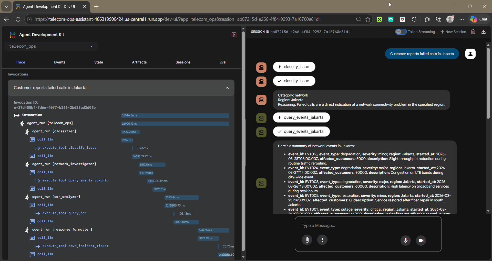
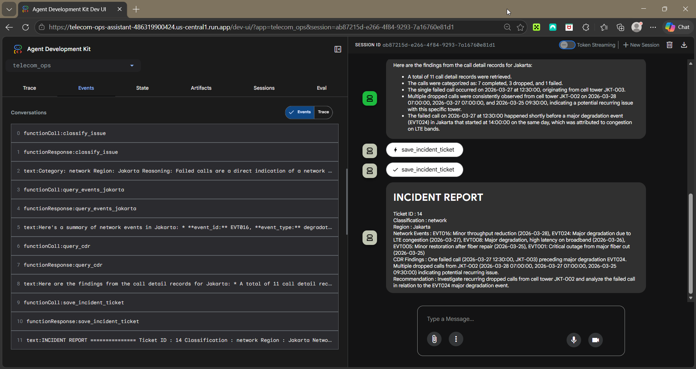
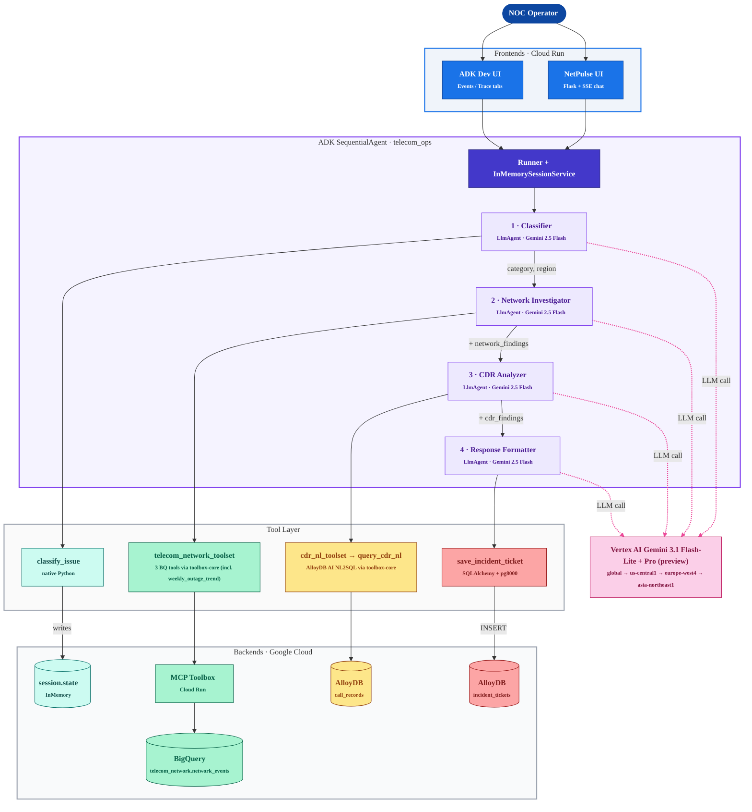

<div align="center">

# NetPulse AI

[](https://www.python.org/downloads/)
[](https://google.github.io/adk-docs/)
[](https://cloud.google.com/vertex-ai)
[](https://cloud.google.com/run)
[](#)

**A multi-agent AI assistant that automates the first-response workflow for telecom Network Operations Center (NOC) teams. One natural-language complaint in, one structured incident ticket out, all in 25-30 seconds.**

**Try it live:** [NetPulse UI](https://netpulse-ui-486319900424.us-central1.run.app) (primary) · [Telecom Ops Assistant](https://telecom-ops-assistant-486319900424.us-central1.run.app) (fallback)

[Demo](#demo) · [Architecture](#architecture) · [How It Works](#how-it-works) · [Getting Started](#getting-started) · [Deployment](#deployment)

</div>

---

## Table of Contents

- [Overview](#overview)
- [Quick Demo](#quick-demo)
- [Demo](#demo)
- [Features](#features)
- [Tech Stack](#tech-stack)
- [Architecture](#architecture)
- [How It Works](#how-it-works)
- [Getting Started](#getting-started)
- [Project Structure](#project-structure)
- [Deployment](#deployment)
- [Configuration](#configuration)
- [Observability](#observability)
- [Lessons & Trade-offs](#lessons--trade-offs)
- [Author](#author)
- [Acknowledgments](#acknowledgments)

---

## Overview

NetPulse AI was built for the **Gen AI Academy APAC Edition 2026** hackathon as a working prototype of how multi-agent orchestration can replace the manual cross-system lookups NOC engineers do dozens of times a day.

When a customer reports something like *"Major dropped calls in Surabaya"*, a NOC operator today has to query at least three independent systems, namely a network event database, a call detail records (CDR) database, and a ticketing system, and manually correlate the results. NetPulse AI does all of that in a single natural-language step:

1. **Classifies** the complaint into a category (network / billing / hardware / service / general) and a region.
2. **Investigates** live network events from BigQuery via MCP Toolbox.
3. **Analyzes** matching call detail records from AlloyDB.
4. **Synthesizes** an incident ticket with a NOC recommendation, persisted to AlloyDB and surfaced to the operator.

The whole workflow runs as a Google ADK `SequentialAgent` orchestrating four `LlmAgent` sub-agents, each backed by Gemini 2.5 Flash on Vertex AI. End-to-end latency is **25-30 seconds** including all four LLM calls and three live database round-trips.

## Quick Demo

A 90-second tour. No login, no setup, no terminal:

1. **Open the live UI** → [https://netpulse-ui-486319900424.us-central1.run.app](https://netpulse-ui-486319900424.us-central1.run.app). The hero landing page explains the four-agent pipeline and lists three pre-seeded example complaints.
2. **Click any launch chip** (e.g., *"Customer reports failed calls in Jakarta"*). The chip handoff prefills the chat input and auto-submits via `?seed=...&autorun=1`, so you land directly on the workspace with the run already in flight.
3. **Watch the timeline animate** — `Classifier → Network Investigator → CDR Analyzer → Response Formatter`. Each entry shows its data source pills, the live tool calls (`query_network_events(...)` or `weekly_outage_trend(region='Jakarta', weeks_back=12, ...)`, `query_cdr_nl(question='How many dropped and failed calls in Jakarta in the last 7 days, grouped by cell_tower_id?')`, `save_incident_ticket(...)`), and a tiny `🌐 via global` chip in the header showing which Vertex AI region answered. On a quota miss or 5s silent hang, the chip grows into `🌐 via global ⤳ us-central1` — failure visible as one extra hop, not a hard 500.
4. **Read the customer-impact card** that fades in once the network investigator returns its rows: total customers affected (summed across BQ network events), severity histogram, and elapsed-since-onset (`~Xm`/`~Xh`/`~Xd`).
5. **Land on the saved incident report** at the bottom: a category badge (network/billing/hardware/service/general), region badge, severity badge, the model's structured `INCIDENT REPORT`, and a recommended-NOC-actions chip panel keyed off the category. The ticket itself is now persisted in AlloyDB — switch to the **Incident Tickets** tab in the top nav and you'll see the row at the top of the list.

Want to see the underlying ADK trace? The fallback service ([`telecom-ops-assistant`](https://telecom-ops-assistant-486319900424.us-central1.run.app)) is the same engine wrapped in the `adk web` Dev UI — `/events` shows every sub-agent turn and `/trace` shows span-by-span timing for every LLM call and tool invocation.

## Demo

### Live deployments

Both services are running on Cloud Run:

| Service | Role | URL |
|---|---|---|
| **NetPulse UI** | Hackathon primary, custom branded chat experience | https://netpulse-ui-486319900424.us-central1.run.app |
| **Telecom Ops Assistant** | Fallback, ADK Dev UI with `/events` and `/trace` observability tabs | https://telecom-ops-assistant-486319900424.us-central1.run.app |

### NetPulse UI: custom Flask chat interface

The primary demo surface. A free-text complaint at the top, four pipeline cards below showing each sub-agent in real time (status, tool calls, output text), carry-over labels showing exactly which session-state keys flow forward to the next agent, and a final dark Incident Report card at the bottom. Streamed via Server-Sent Events.



### Use case diagram

The end-to-end workflow from operator complaint to persisted incident ticket.



### ADK Dev UI: Trace tab

Built-in observability that comes with `adk deploy cloud_run --with_ui`. Every LLM call, tool invocation, prompt, and response is captured as a span with millisecond timing.



### ADK Dev UI: Events tab

Streaming sub-agent conversation showing each `LlmAgent` taking its turn, calling its tool, and producing its `output_key` for the next agent.



## Features

- **Multi-agent orchestration.** Google ADK 1.14 `SequentialAgent` chaining four `LlmAgent` sub-agents with explicit session-state hand-off via `output_key`. Not multi-tool inside one big agent, but four specialized agents each owning one responsibility.
- **Cross-source evidence correlation.** Automatically links BigQuery network events with AlloyDB CDR rows to surface root causes (e.g., a dropped call from cell tower JKT-002 correlated with the major fiber cut event EVT001).
- **Persistent structured output.** Every run inserts an auditable row in AlloyDB `incident_tickets` with category, region, related events, CDR findings, and a NOC recommendation. Queryable, joinable, archivable, not a transient chat response.
- **Two frontends, one engine.** A custom NetPulse UI (Flask + Server-Sent Events) for branded demo, plus the built-in ADK Dev UI (`/events` + `/trace` tabs) for free observability. Both call the same `Runner + InMemorySessionService + root_agent`.
- **Multi-continent inference with region failover + 5s hang protection (visible in the UI).** Vertex AI defaults to the `global` multi-region pool, then fails over per-LlmAgent through `us-central1` → `europe-west4` → `asia-northeast1` on `RESOURCE_EXHAUSTED` 429 *or* on a 5s `asyncio.wait_for` timeout (the latter cancels the in-flight HTTP call so only one region request is ever live per agent). Each agent walks the ladder independently, so one agent's quota miss or hang does not bind the others. Per-attempt telemetry surfaces in the chat workspace as a `🌐 via global` chip on each timeline entry — on failover, the chip grows into `🌐 via global ⤳ us-central1`, so failure is visible as one extra hop instead of opaque latency. Implementation in `telecom_ops/vertex_failover.py`; UI wiring via the `region_attempt` SSE event in `netpulse-ui/agent_runner.py`.
- **Boot-resilient by design.** MCP Toolbox client wrapped in `try/except`, AlloyDB engine uses `pool_pre_ping=True` + `pool_recycle=300` to survive idle-connection reaping, agent runner is lazy-loaded so frontend tabs that don't need the agent stay functional even if the toolbox is cold.
- **Validated end-to-end.** 70+ incident tickets created across 5 Indonesian regions and 3 issue categories during pre-submission and refinement-phase stress testing. Zero unrecovered `429 RESOURCE_EXHAUSTED` errors — every quota miss is absorbed by the failover ladder and surfaces in the UI as a `⤳` extension on the region chip.

## Tech Stack

| Component | Technology | Why |
|---|---|---|
| Agent framework | **Google ADK 1.14.0** | `SequentialAgent` + `LlmAgent` give built-in state management, `output_key` chaining, and the native function-calling tool protocol, all with zero glue code |
| LLM (per agent) | **Gemini 3.1 Flash-Lite preview** for classifier + network_investigator + cdr_analyzer · **Gemini 3.1 Pro preview** for response_formatter | Speed-tier model on the upstream agents (~0.6–1.9s per call), quality-tier model on the user-visible synthesis. Constants `MODEL_FAST` and `MODEL_SYNTHESIS` in `telecom_ops/agent.py` — one-line revert to `gemini-2.5-flash` / `gemini-2.5-pro` (GA) if preview endpoints destabilize. |
| Inference region | **`global` with multi-continent failover** | Default to Google's multi-region pool (`global`); on `RESOURCE_EXHAUSTED` 429 OR 5s silent-hang timeout, fail over through `us-central1` (US) → `europe-west4` (EU) → `asia-northeast1` (Tokyo). Per-LlmAgent failover state in `telecom_ops/vertex_failover.py`. APAC entries (asia-southeast1/2) removed because Pro-preview returned `400 FAILED_PRECONDITION` there. |
| Tool gateway | **MCP Toolbox for Databases** (Cloud Run) | Direct BigQuery MCP returns 403 on Cloud Run; Toolbox is the proven ADK-compatible bridge |
| Analytical store | **BigQuery** (`telecom_network.network_events`) | 50 000-event dataset across 10 Indonesian cities, 2025-11-01 → 2026-04-30. **DAY-partitioned on `started_at` and clustered by `(region, severity)`** so the new `weekly_outage_trend` rollup prunes to the requested window (a 7-day query reads ~25 KB instead of the full table). |
| Operational store + NL2SQL | **AlloyDB for PostgreSQL 17** with the `alloydb_ai_nl` extension | Hosts `call_records` (5 000 CDRs with realistic dropped/failed clustering around per-city anchor windows) and `incident_tickets` (persistent agent output). The `cdr_analyzer` agent calls `query_cdr_nl(question='…')`; the toolbox routes to `alloydb_ai_nl.execute_nl_query('netpulse_cdr_config', $1)` and connects as a read-only role (`netpulse_nl_reader`, `SELECT` on `call_records` only) so destructive NL is structurally blocked. Setup script: `scripts/setup_alloydb_nl.py`. |
| Operational store driver | **SQLAlchemy 2 + pg8000** | Pure-Python wire driver, works in Cloud Run without C extensions |
| Custom UI | **Flask 3 + Server-Sent Events** | Streams ADK events into animated chat cards; uses `fetch()` + `ReadableStream` (POST + SSE) |
| Async-to-sync bridge | **threading.Thread + queue.Queue** | Drains the async ADK Runner from a sync Flask request handler without buffering |
| Hosting | **Cloud Run** | Both the ADK Dev UI service and the Custom NetPulse UI service |
| Auth | **Application Default Credentials** | Vertex AI + BigQuery + AlloyDB all reuse the same gcloud ADC token |

## Architecture

The mermaid block below renders natively on GitHub. A pre-rendered PNG also lives at [`docs/architecture.png`](docs/architecture.png) for use in slides and offline viewing.

**What's load-bearing in the diagram:**

- **`SequentialAgent` over four `LlmAgent`s, not one big agent with four tools.** Each sub-agent owns one responsibility, one tool (or one toolset), and one `output_key` written into `session.state`. Downstream agents read that state via `{key?}` defensive substitution so a partial chain still produces a graceful report.
- **MCP Toolbox is the BigQuery bridge — not the direct BigQuery MCP endpoint.** The direct endpoint returns 403 / connection-closed when called from a Cloud Run-hosted ADK agent; the Toolbox-as-intermediary pattern is the proven workaround. 2 universal parameterized tools live in `tools.yaml`: `query_network_events(region, severity, event_type, days_back, limit)` and `query_affected_customers_summary(region, days_back)`. Adding a new city is a CSV change, not a toolbox redeploy.
- **Vertex AI region is failover-ranked, not pinned.** Every LLM-call edge in the diagram routes through `RegionFailoverGemini`, which defaults to `global` and walks `us-central1 → europe-west4 → asia-northeast1` on `RESOURCE_EXHAUSTED` 429 OR a 5s silent-hang timeout (only one HTTP call ever in flight per agent — the next attempt cancels the prior). State is per-`LlmAgent`, so one agent's quota miss does not bind the others. Per-attempt region telemetry surfaces in the chat UI's timeline header.
- **Two frontends, one engine.** Both `NetPulse UI` (Flask + SSE) and `ADK Dev UI` (`/events` + `/trace`) call the same `Runner + InMemorySessionService + root_agent`. The custom UI is the demo surface; the Dev UI is the free debug surface. Building one didn't require rebuilding the other.
- **Async ADK Runner ↔ sync Flask via thread + queue.** The Flask SSE generator pulls from a `queue.Queue` populated by a per-request worker thread that runs its own asyncio loop. The naive `asyncio.run()` wrapper buffers all events into a list before yielding, which breaks the chat-card animation — that's why this bridge looks heavier than it needs to be at first glance.
- **AlloyDB is read AND write.** `call_records` (read by CDR Analyzer) and `incident_tickets` (written by Response Formatter) are two tables in the same Postgres-compatible cluster. Both engines use `pool_pre_ping=True` + `pool_recycle=300` to survive AlloyDB's idle TCP reaper.



## How It Works

### The four sub-agents

| # | Agent | Tool | Backend | Session-state output |
|---|---|---|---|---|
| 1 | **Classifier** | `classify_issue` | in-memory only | `category`, `region`, `complaint`, `reasoning`, `classification` |
| 2 | **Network Investigator** | `telecom_network_toolset` (3 tools: `query_network_events`, `query_affected_customers_summary`, and the partition-pruning `weekly_outage_trend` rollup) | MCP Toolbox → BigQuery | `network_findings` |
| 3 | **CDR Analyzer** | `cdr_nl_toolset` → `query_cdr_nl(question)` (AlloyDB AI NL2SQL) | MCP Toolbox → AlloyDB `alloydb_ai_nl.execute_nl_query` (read-only role) | `cdr_findings` |
| 4 | **Response Formatter** | `save_incident_ticket` | AlloyDB `incident_tickets` (write) | `final_report`, `ticket_id` |

Each agent is an `LlmAgent` with:

- A long, explicit instruction (in `telecom_ops/prompts.py`) describing its role and the exact format of its output
- Defensive `{key?}` substitution syntax so a partial chain (e.g., upstream agent failed) still produces a graceful report instead of crashing on a `KeyError`
- An `output_key` that captures the agent's final text response into session state under a known name
- Exactly one tool, except the Network Investigator which loads an entire toolset from the MCP Toolbox

### Carry-over between sub-agents

The `SequentialAgent` runs each sub-agent in order, but the agents communicate through `session.state`, not through return values. The carry-over set is exactly what each downstream agent's instruction template references:

```
1. Classifier            → writes: complaint, category, region, reasoning, classification
                                   ↓
2. Network Investigator  → reads: category, region          → writes: network_findings
                                   ↓
3. CDR Analyzer          → reads: category, region, network_findings   → writes: cdr_findings
                                   ↓
4. Response Formatter    → reads: classification, category, region, network_findings, cdr_findings
                         → writes: final_report, ticket_id
```

The custom NetPulse UI exposes these carry-over keys explicitly between cards so judges can see exactly which session-state values flow forward at each step.

### One example run

Input: *"Customer reports failed calls in Jakarta"*

| Step | Agent | What happens |
|---|---|---|
| 1 | Classifier (~3 s) | LLM picks `category=network`, `region=Jakarta` and writes them to session state |
| 2 | Network Investigator (~3 s) | LLM picks `weekly_outage_trend(region='Jakarta', weeks_back=12)` (the complaint mentions "trend" / "lately") via MCP Toolbox; gets 12 weekly rollup rows from BigQuery — `event_count`, `critical_count`, `major_count`, `total_affected`, `avg_mttr_minutes` — and summarizes the worst weeks |
| 3 | CDR Analyzer (~3 s) | LLM calls `query_cdr_nl(question="How many dropped and failed calls in Jakarta in the last 30 days, grouped by cell_tower_id?")`; AlloyDB AI NL2SQL translates the question to SQL and returns 6 rows (one per JKT-001..006 tower); the LLM correlates the JKT-002/003 spike with the network findings |
| 4 | Response Formatter (~5 s) | LLM calls `save_incident_ticket(...)`; AlloyDB returns `ticket_id=15`; emits the final structured INCIDENT REPORT |

End-to-end: **~15 seconds**, three database round-trips (BQ partitioned + clustered scan, AlloyDB AI NL2SQL on `call_records`, AlloyDB INSERT on `incident_tickets`), zero human intervention.

## Getting Started

### Prerequisites

- Python 3.12+
- Google Cloud project with these APIs enabled: Vertex AI, BigQuery, AlloyDB, Cloud Run
- `gcloud` CLI configured: `gcloud auth login` AND `gcloud auth application-default login`
- AlloyDB cluster reachable (public IP for local dev or VPC connector for Cloud Run)
- BigQuery dataset `telecom_network.network_events` populated
- MCP Toolbox for Databases deployed to Cloud Run with the `telecom_network_toolset`

### Installation

```bash
git clone https://github.com/adityonugrohoid/hackathon-telecom-ops.git
cd hackathon-telecom-ops

python3 -m venv .venv
source .venv/bin/activate

# Install the agent package
pip install -r telecom_ops/requirements.txt

# Plus Flask for the custom UI
pip install flask gunicorn google-cloud-bigquery
```

### Configure the AlloyDB schema

```bash
python setup_alloydb.py
```

This creates the `call_records` and `incident_tickets` tables (idempotent, safe to re-run).
Pass `--seed` to also load `docs/seed-data/*.csv` into both tables — see [Bring your own data](#bring-your-own-data).

### Run the ADK Dev UI locally

```bash
export GOOGLE_APPLICATION_CREDENTIALS=~/.config/gcloud/legacy_credentials/<your-account>/adc.json
adk web
```

Browse to `http://localhost:8000`, select `telecom_ops`, send a query.

### Run the custom NetPulse UI locally

```bash
cd netpulse-ui
export GOOGLE_APPLICATION_CREDENTIALS=~/.config/gcloud/legacy_credentials/<your-account>/adc.json
export GOOGLE_CLOUD_PROJECT=plated-complex-491512-n6
export GOOGLE_CLOUD_LOCATION=global
export GOOGLE_GENAI_USE_VERTEXAI=TRUE
export DATABASE_URL='postgresql+pg8000://postgres:<password>@<alloydb-public-ip>:5432/postgres'
export TOOLBOX_URL='https://network-toolbox-486319900424.us-central1.run.app'

python app.py
```

Browse to `http://localhost:8080`. Four tabs:

| Tab | What it shows | Backend |
|---|---|---|
| **Chat** | The streaming agent pipeline | ADK SequentialAgent |
| **Network Events** | Live BigQuery query of `network_events` | BigQuery |
| **Call Records** | Live AlloyDB query of `call_records` | AlloyDB read |
| **Incident Tickets** | Live AlloyDB query of `incident_tickets` | AlloyDB write target |

## Bring your own data

NetPulse is dataset-driven. Match the [data contract in `docs/SCHEMA.md`](docs/SCHEMA.md),
override the `BQ_DATASET`, `BQ_NETWORK_TABLE`, `AL_CALL_TABLE`, `AL_TICKET_TABLE`
env vars (full list in [Configuration](#configuration)), and the agents work
against your infrastructure with no code changes.

The repo ships with the canonical schema in code (`scripts/setup_bigquery.py` for
BigQuery, `setup_alloydb.py` for AlloyDB) and the original hackathon sample data
in `docs/seed-data/{network_events,call_records,incident_tickets}.csv` so a fresh
clone can stand up an end-to-end working demo against any GCP project + AlloyDB
instance.

Bootstrap a fresh project with the included sample data:

```bash
export GOOGLE_CLOUD_PROJECT=your-project
export GOOGLE_APPLICATION_CREDENTIALS=~/.config/gcloud/legacy_credentials/<account>/adc.json
export DATABASE_URL='postgresql+pg8000://postgres:<password>@<alloydb-host>:5432/postgres'
export NL_READER_PASSWORD='<strong-password-meeting-complexity>'  # only for --nl-setup
bash scripts/setup_byo.sh --seed --nl-setup
```

Without `--seed`, the script only creates the dataset + tables (idempotent —
safe to re-run on an existing deployment). With `--seed`, the seeded tables
are TRUNCATE+RELOAD'd from the CSVs, restoring the canonical demo state. With
`--nl-setup`, the AlloyDB AI NL2SQL stack also gets installed: the
`alloydb_ai_nl` extension, an LLM model registration, the `netpulse_cdr_config`
configuration with `call_records` registered, schema-context generation
(blocking 3-5 min), and the `netpulse_nl_reader` read-only role used by the
MCP Toolbox. Requires the `alloydb_ai_nl.enabled=on` instance flag to be set
beforehand:

```bash
gcloud alloydb instances update <instance> \
  --cluster=<cluster> --region=<region> \
  --database-flags=password.enforce_complexity=on,alloydb_ai_nl.enabled=on
```

Multi-tenant SaaS UI (login, per-tenant dataset isolation) is roadmapped for v2.
The data layer is already deployable against any compatible infrastructure.

## Project Structure

```
hackathon-telecom-ops/
├── telecom_ops/                          # The ADK agent package (deployed to Cloud Run)
│   ├── __init__.py                       #   from . import agent
│   ├── agent.py                          #   4 LlmAgents + SequentialAgent root_agent
│   ├── tools.py                          #   classify_issue, query_cdr, save_incident_ticket + singletons
│   ├── prompts.py                        #   4 sub-agent instructions with {key?} state references
│   ├── .env                              #   GOOGLE_GENAI_USE_VERTEXAI=TRUE + region (gitignored)
│   └── requirements.txt                  #   google-adk==1.14.0 + toolbox-core + sqlalchemy + pg8000
│
├── netpulse-ui/                          # Custom Flask web UI (sibling deploy)
│   ├── app.py                            #   Flask routes + SSE plumbing + static .env loader
│   ├── agent_runner.py                   #   Bridges sync Flask to async ADK Runner via thread+queue
│   ├── data_queries.py                   #   Read-only BigQuery + AlloyDB queries for the data tabs
│   ├── templates/                        #   base.html, chat.html, network_events.html, ...
│   ├── static/style.css                  #   Centralized theme tokens at :root, color-mix() variants
│   ├── static/netpulse-logo.png          #   Logo asset (Flask static)
│   ├── requirements.txt                  #   flask + gunicorn + google-cloud-bigquery + ADK chain
│   └── Dockerfile                        #   python:3.12-slim + gunicorn
│
├── docs/                                 # Submission deck + screenshots + diagrams
│   ├── Prototype Submission Deck...pptx  #   Hack2Skill submission deck
│   ├── architecture.mmd                  #   Mermaid source for the system diagram
│   ├── architecture.png                  #   Pre-rendered architecture diagram
│   └── screenshots/                      #   ADK Dev UI + NetPulse UI captures
│
├── setup_alloydb.py                      # Idempotent DDL for call_records + incident_tickets (+ optional --seed)
├── scripts/
│   ├── setup_bigquery.py                 # Idempotent DDL for the BigQuery network_events table (+ optional --seed and --recreate)
│   ├── setup_alloydb_nl.py               # Idempotent AlloyDB AI NL2SQL setup (extension + config + reader role)
│   ├── generate_network_events.py        # Deterministic 50 000-row generator for docs/seed-data/network_events.csv
│   ├── generate_call_records.py          # Deterministic 5 000-row CDR generator for docs/seed-data/call_records.csv
│   └── setup_byo.sh                      # Orchestrator: runs setup_bigquery.py + setup_alloydb.py + (optional) setup_alloydb_nl.py
├── docs/
│   ├── SCHEMA.md                         # Column-by-column data contract for the 3 tables
│   └── seed-data/                        # Canonical sample CSVs (network_events, call_records, incident_tickets)
├── CLAUDE.md                             # Project context for AI coding assistants
└── README.md                             # This file
```

## Deployment

### ADK service (telecom_ops): deployed

```bash
gcloud config configurations activate gcp-personal   # personal account owns the project

uvx --from google-adk==1.14.0 \
adk deploy cloud_run \
  --project=plated-complex-491512-n6 \
  --region=us-central1 \
  --service_name=telecom-ops-assistant \
  --with_ui \
  telecom_ops \
  -- \
  --service-account=lab2-cr-service@plated-complex-491512-n6.iam.gserviceaccount.com \
  --set-env-vars="GOOGLE_GENAI_USE_VERTEXAI=TRUE,GOOGLE_CLOUD_PROJECT=plated-complex-491512-n6,GOOGLE_CLOUD_LOCATION=global,TOOLBOX_URL=https://network-toolbox-486319900424.us-central1.run.app"

# Background-run deploys silently answer N to the "allow unauthenticated" prompt; fix:
gcloud run services add-iam-policy-binding telecom-ops-assistant \
  --region=us-central1 \
  --member="allUsers" \
  --role="roles/run.invoker" \
  --project=plated-complex-491512-n6
```

| Resource | Value |
|---|---|
| Service | `telecom-ops-assistant` |
| Cloud Run region | `us-central1` |
| Vertex AI region | `global` (default; failover ladder via `RegionFailoverGemini` walks `us-central1 → europe-west4 → asia-northeast1`) |
| URL | `https://telecom-ops-assistant-486319900424.us-central1.run.app` |
| Service account | `lab2-cr-service@plated-complex-491512-n6.iam.gserviceaccount.com` |
| Public access | `allUsers` → `roles/run.invoker` |

### NetPulse UI service: deployed

The custom Flask UI deploys from the parent directory so the build context can include both `netpulse-ui/` and `telecom_ops/`. The parent-level `Dockerfile` copies both packages into the image, and `.gcloudignore` filters the build context to skip the venv, scratch directories, and the submission deck. VPC connector flags route the container to AlloyDB through the private IP.

| Resource | Value |
|---|---|
| Service | `netpulse-ui` |
| Cloud Run region | `us-central1` |
| Vertex AI region | `global` (default; failover via `RegionFailoverGemini` walks `us-central1 → europe-west4 → asia-northeast1`) |
| URL | `https://netpulse-ui-486319900424.us-central1.run.app` |
| VPC | `easy-alloydb-vpc` / `easy-alloydb-subnet` |
| Public access | `allUsers` → `roles/run.invoker` |

## Configuration

All configuration is via environment variables (no `python-dotenv`; the agent package auto-loads `.env` from `telecom_ops/.env` and the Flask app uses a stdlib `_load_dotenv_stdlib` parser).

| Variable | Purpose | Default / example |
|---|---|---|
| `GOOGLE_CLOUD_PROJECT` | GCP project for Vertex AI + BQ + AlloyDB (required) | `plated-complex-491512-n6` |
| `GOOGLE_CLOUD_LOCATION` | Vertex AI inference region (initial — failover ladder kicks in on 429) | `global` |
| `GOOGLE_GENAI_USE_VERTEXAI` | Force Vertex AI (vs Google AI Studio API key) | `TRUE` |
| `GOOGLE_APPLICATION_CREDENTIALS` | Path to ADC JSON for local runs | `~/.config/gcloud/legacy_credentials/<account>/adc.json` |
| `DATABASE_URL` | AlloyDB SQLAlchemy URL (required) | `postgresql+pg8000://postgres:<pwd>@<ip>:5432/postgres` |
| `TOOLBOX_URL` | MCP Toolbox endpoint (required by the ADK agent) | `https://network-toolbox-486319900424.us-central1.run.app` |
| `BQ_DATASET` | BigQuery dataset that owns `network_events` | `telecom_network` |
| `BQ_NETWORK_TABLE` | BigQuery table the network investigator reads | `network_events` |
| `AL_CALL_TABLE` | AlloyDB table the CDR analyzer reads | `call_records` |
| `AL_TICKET_TABLE` | AlloyDB table the response formatter writes | `incident_tickets` |

For local development, use the AlloyDB instance's public IP. For Cloud Run, override `DATABASE_URL` with the private IP and add VPC connector flags so the container can reach AlloyDB through the VPC.

The `BQ_*` and `AL_*` variables exist so a fork can point NetPulse at any GCP project + AlloyDB cluster that matches the [data contract in `docs/SCHEMA.md`](docs/SCHEMA.md). Defaults preserve the hackathon's wiring; overrides enable the [Bring your own data](#bring-your-own-data) flow.

## Observability

Two free observability surfaces come with the ADK deployment:

- **`/events`** streams the sub-agent conversation, including every `LlmAgent` turn, every tool call, and every state mutation
- **`/trace`** is a full timeline view with span timing for every LLM call and tool invocation

The custom NetPulse UI also exposes the SSE event stream at `POST /api/query` if you want to drive it programmatically. Each event is JSON-encoded with shape:

```
data: {"type": "agent_start", "agent": "classifier"}
data: {"type": "region_attempt", "agent": "classifier", "region": "global", "outcome": "ok"}
data: {"type": "tool_call", "agent": "classifier", "tool": "classify_issue", "args": {...}}
data: {"type": "tool_response", "agent": "classifier", "tool": "classify_issue", "result": {...}}
data: {"type": "text", "agent": "classifier", "text": "Category: network..."}
...
data: {"type": "complete", "ticket_id": 32, "final_report": "INCIDENT REPORT..."}
```

`region_attempt` events fire one per Vertex AI region attempt from `RegionFailoverGemini`. On a quota miss you'll see an extra event with `"outcome": "failover"` and the upstream error in `message`, immediately followed by another attempt against the next region in the ranked ladder.

## Lessons & Trade-offs

A handful of non-obvious decisions worth surfacing:

- **MCP Toolbox vs direct BigQuery MCP.** The endpoint `https://bigquery.googleapis.com/mcp` returns 403 / connection-closed when called from a Cloud Run-hosted ADK agent. The MCP Toolbox for Databases (a small Cloud Run service that wraps a `tools.yaml` of parameterized SQL queries) is the proven workaround. We use 2 universal parameterized toolset entries: `query_network_events(region, severity, event_type, days_back, limit)` and `query_affected_customers_summary(region, days_back)`. Sentinel defaults (`"*"` for strings, `36500` for `days_back`, `50` for `limit`) skip a filter without nullable binds — toolbox v0.23 + the BigQuery Go client both reject null parameter binds at different validation steps. **Phase 10 collapsed this from 8 hardcoded per-city tools** so adding a new region is a CSV change, not a `tools.yaml` edit + toolbox redeploy.
- **Vertex AI region matters for APAC, and a single pinned region is fragile.** `us-central1` is the default Vertex AI region, but it's also the most contested Dynamic Shared Quota (DSQ) pool. During the APAC hackathon, a baseline query that worked at 3 a.m. would 429 at 9 a.m. local time as US developers came online. Switching to `asia-southeast1` eliminated 429s — but a single trial-billing project on a single region has no headroom if that region ever spikes. The refinement-phase fix replaces the static pin with a `global` default plus a multi-continent failover ladder (`global` → `us-central1` → `europe-west4` → `asia-northeast1`); each `LlmAgent` walks the ladder independently. **Then refinement Phase 9 surfaced two further lessons:** (1) Quota errors are not the only failure mode — a Vertex AI HTTP request can hang silently and never raise. We added a 5s `asyncio.wait_for` per attempt that cancels the in-flight call and triggers failover the same way a 429 would. (2) Preview models can be region-allowlisted at the project level — `gemini-3.1-pro-preview` is `global`-only for our project (us-central1 returns `404 NOT_FOUND`), so the ladder is structurally a no-op for whichever agent uses it. The lesson is: failover is only as good as the model's per-region availability matrix. See `telecom_ops/vertex_failover.py`.
- **Async ADK Runner ↔ sync Flask.** `runner.run_async()` is async-only, but Flask is sync. The naive `asyncio.run()` wrapper buffers all events into a list before yielding the first byte, breaking the chat-card animation. The fix in `netpulse-ui/agent_runner.py` is a per-request worker thread running its own asyncio loop and pushing converted events onto a `queue.Queue` that the SSE generator drains in real time.
- **Eager-init singletons.** The agent's `tools.py` instantiates the MCP Toolbox client and the AlloyDB engine at module import. The toolbox client is wrapped in `try/except` (so the agent boots even if the toolbox is cold). The AlloyDB engine uses `pool_pre_ping=True` + `pool_recycle=300` to survive connection-pool staleness when the dev box goes idle for 30+ minutes between demos.
- **Defensive prompt substitution.** All cross-agent state references in `prompts.py` use ADK's `{key?}` optional syntax. If an upstream agent fails before populating its `output_key`, downstream agents still get a graceful empty string instead of crashing on a `KeyError` during instruction formatting.
- **Two frontends, one engine.** The ADK Dev UI gives free `/events` and `/trace` tabs. Building a custom UI doesn't replace it; it complements it. The NetPulse UI is the *demo* surface (branded, animated, narrated); the ADK Dev UI is the *debug* surface (every span, every value).

## Author

**Adityo Nugroho** ([@adityonugrohoid](https://github.com/adityonugrohoid))

Built for the **Gen AI Academy APAC Edition 2026** hackathon.

## Acknowledgments

- [Google Agent Development Kit](https://google.github.io/adk-docs/), the orchestration framework that made the four-agent chain expressible in ~50 lines of Python
- [MCP Toolbox for Databases](https://googleapis.github.io/genai-toolbox/), the bridge that makes BigQuery callable from ADK agents on Cloud Run
- [Vertex AI Gemini 2.5 Flash](https://cloud.google.com/vertex-ai), fast, cheap, available in `asia-southeast1`
- [AlloyDB for PostgreSQL](https://cloud.google.com/alloydb), wire-compatible Postgres with managed scaling, queryable from local dev via public IP and from Cloud Run via VPC connector
