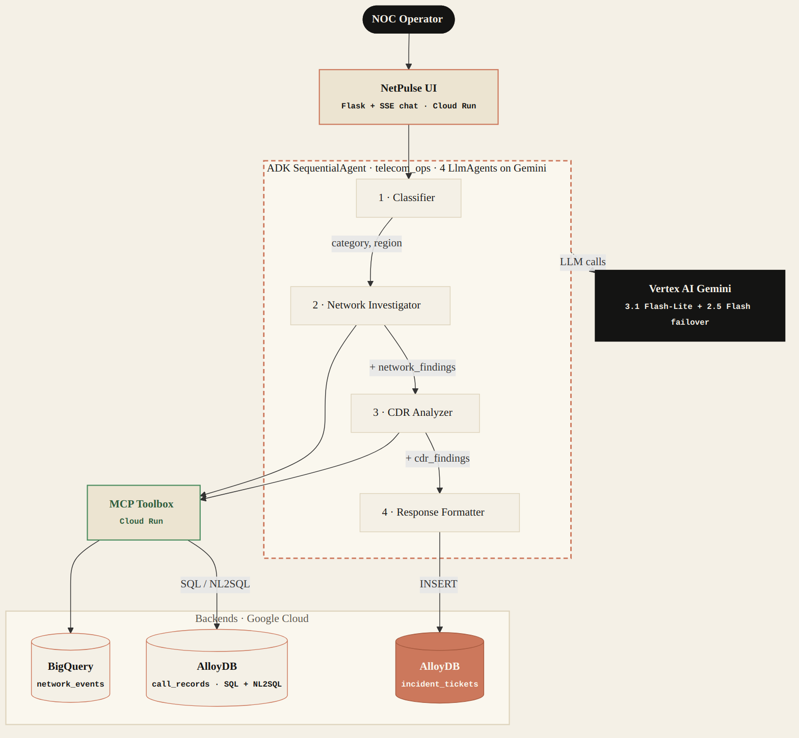

<div align="center">

# NetPulse AI

[](https://www.python.org/downloads/)
[](https://google.github.io/adk-docs/)
[](https://cloud.google.com/vertex-ai)
[](https://cloud.google.com/run)

**A multi-agent AI assistant that turns a telecom customer's natural-language complaint into a structured incident ticket — in 25–30 seconds, end-to-end.**

[**Try it live →**](https://netpulse-ui-486319900424.us-central1.run.app)

[Features](#features) · [Architecture](#architecture) · [Tech stack](#tech-stack) · [Run it locally](#run-it-locally) · [Deploy](#deploy)

</div>

---

## Overview

Built for the **Gen AI Academy APAC Edition 2026** hackathon as a working
prototype of how multi-agent orchestration replaces the manual cross-system
lookups that NOC engineers do dozens of times a day.

When a customer reports something like *"Major dropped calls in Surabaya"*,
a NOC operator today has to query at least three independent systems — a
network event database, a call detail records (CDR) database, and a
ticketing system — and manually correlate the results. NetPulse AI does all
of that in a single natural-language step:

1. **Classifies** the complaint into a category (network / billing / hardware / service / general) and a region.
2. **Investigates** live network events from BigQuery via MCP Toolbox.
3. **Analyzes** matching call detail records from AlloyDB via natural-language SQL.
4. **Synthesizes** an incident ticket with a NOC recommendation, persisted to AlloyDB and surfaced to the operator.

The whole workflow runs as a Google ADK `SequentialAgent` orchestrating four
`LlmAgent` sub-agents, each backed by Gemini on Vertex AI. End-to-end latency
is **25–30 seconds** including all four LLM calls and three live database
round-trips.

## Features

- **Multi-agent orchestration.** Four specialized ADK `LlmAgent` sub-agents
  chained by a `SequentialAgent`, each owning one responsibility, one tool
  (or one toolset), and one `output_key` written into `session.state`.
  Downstream agents read upstream state via defensive `{key?}` substitution
  so a partial chain still produces a graceful report.
- **Two-tier CDR analyzer: parameterized SQL primary, NL2SQL fallback.**
  The CDR analyzer's default path is two fixed-shape parameterized tools
  (`query_cdr_summary`, `query_cdr_worst_towers`) that the agent calls
  with extracted `(region, days_back)` args — typical execution <2s.
  `query_cdr_nl` stays available as a fallback for off-script prompts
  (e.g. "weekend vs weekday dropped-call rates"), routing through
  AlloyDB AI's `alloydb_ai_nl.execute_nl_query`. The agent picks the
  path; the toolbox is shape-agnostic. Boxing NL2SQL as fallback bounds
  the demo to ~10–15s while keeping the capability available — observed
  NL2SQL tail latency was 30–130s due to Vertex us-central1 retries
  inside the AlloyDB AI translator. **Read-only is structural for both
  paths** — the toolbox connects as a `netpulse_nl_reader` Postgres role
  with `SELECT` on `call_records` only, so a misbehaving model can't
  drop a table on either path.
- **Partition-pruning analytical rollup on BigQuery.** `network_events` is
  DAY-partitioned on `started_at` and clustered by `(region, severity)`
  across 50 000 events / 10 cities / 6 months of seed data. The
  `weekly_outage_trend` tool uses partition pruning so a 12-week scan
  reads ~25 KB instead of the full table.
- **Vertex AI failover that's visible in the UI.** Every LLM call routes
  through `RegionFailoverGemini`, which targets the single `global` Vertex
  endpoint and walks a 4-attempt **model ladder** on `RESOURCE_EXHAUSTED`
  429 or `asyncio.TimeoutError`: primary `gemini-3.1-flash-lite-preview`
  10s → primary again after 0.5s sleep 20s → `gemini-3-flash-preview`
  intermediate 20s → `gemini-2.5-flash` GA fallback 30s. Each model has
  its own quota bucket, so the GA fallback is a real escape hatch under
  preview-pool pressure. The chat workspace renders the walk as a
  `via gemini-3.1-flash-lite-preview ↪ gemini-3-flash-preview ↪ gemini-2.5-flash`
  chip on each timeline entry — failure visible as model-swap hops, not
  a hard 500.
- **Streaming SSE chat with collapsible per-agent terminal panels.** The
  Flask workspace renders the agent run as a four-card vertical timeline
  with a Claude-Code-style terminal panel inside each card (traffic-light
  bar + populated mono output below). Each panel collapses by default and
  expands on click. Live timer + status pill + model-failover chip stay
  visible without expanding.
- **Persistent structured output.** Every run inserts an auditable row in
  AlloyDB `incident_tickets` with category, region, related events, CDR
  findings, and a NOC recommendation. Queryable, joinable, archivable —
  not a transient chat response. The workspace surfaces the saved ticket
  back to the operator with a category-keyed chip panel of recommended
  NOC actions.
- **Two frontends, one engine.** A custom NetPulse UI (Flask + SSE) for
  the branded demo, plus the built-in ADK Dev UI (`/events` + `/trace`
  tabs) for free observability. Both call the same
  `Runner + InMemorySessionService + root_agent`.
- **Boot-resilient by design.** MCP Toolbox client wrapped in `try/except`
  so the agent boots even when the toolbox is cold. AlloyDB engine uses
  `pool_pre_ping=True` + `pool_recycle=300` to survive AlloyDB's idle TCP
  reaper. Agent runner is lazy-loaded so frontend tabs that don't need
  the agent stay functional even if the toolbox is unreachable.
- **Validated end-to-end.** 70+ incident tickets created across 5
  Indonesian regions and 3 issue categories during pre-submission and
  refinement-phase testing. Zero unrecovered demo failures — every
  preview-model 429 either clears on the same-model retry (most cases)
  or surfaces visibly as a model-swap chip and still produces a complete
  ticket.

## Architecture



What's load-bearing in this picture:

- **`SequentialAgent` over four `LlmAgent`s, not one big agent with four
  tools.** Each sub-agent owns one responsibility, one tool, and one
  `output_key`. Carry-over flows through `session.state`.
- **MCP Toolbox is the BigQuery bridge — not the direct BigQuery MCP
  endpoint.** The direct endpoint returns 403 / connection-closed when
  called from a Cloud Run-hosted ADK agent; Toolbox-as-intermediary is
  the proven workaround. Three parameterized tools cover the BigQuery
  network side; on AlloyDB the same toolbox serves both query modes —
  two parameterized SQL tools for the structured fast path and one
  NL2SQL fallback for free-form prompts.
- **Vertex AI uses a model ladder at a single endpoint, not a region
  ladder.** Preview models are gated to specific regions per project, so
  the prior region ladder always 404'd on the first failover hop. Each
  model has its own quota bucket — the GA fallback is a real escape
  hatch.
- **Async ADK Runner ↔ sync Flask via thread + queue.** The Flask SSE
  generator pulls from a `queue.Queue` populated by a per-request worker
  thread that runs its own asyncio loop. The naive `asyncio.run()` wrapper
  buffers events into a list before yielding, which breaks the chat-card
  animation.

For the full design rationale, see [`docs/LESSONS.md`](docs/LESSONS.md).

## Tech stack

| Component | Technology |
|---|---|
| Agent framework | Google ADK 1.14 (`SequentialAgent` + `LlmAgent`) |
| LLM | Gemini 3.1 Flash-Lite preview (primary) + Gemini 2.5 Flash (GA fallback) on Vertex AI |
| Tool gateway | MCP Toolbox for Databases (Cloud Run) |
| Analytical store | BigQuery — partitioned + clustered `network_events` |
| Operational store + NL2SQL | AlloyDB for PostgreSQL 17 + `alloydb_ai_nl` extension |
| Driver | SQLAlchemy 2 + pg8000 (pure-Python wire driver) |
| Custom UI | Flask 3 + Server-Sent Events |
| Hosting | Cloud Run (both services) |
| Auth | Application Default Credentials |

## Run it locally

```bash
git clone https://github.com/adityonugrohoid/hackathon-telecom-ops.git
cd hackathon-telecom-ops

python3 -m venv .venv
source .venv/bin/activate
pip install -r telecom_ops/requirements.txt -r netpulse-ui/requirements.txt

# Configure (see docs/CONFIG.md for the full env-var matrix)
export GOOGLE_CLOUD_PROJECT=your-project
export GOOGLE_CLOUD_LOCATION=global
export GOOGLE_GENAI_USE_VERTEXAI=TRUE
export DATABASE_URL='postgresql+pg8000://postgres:<pwd>@<alloydb-host>:5432/postgres'
export TOOLBOX_URL='https://network-toolbox-486319900424.us-central1.run.app'

# Stand up the data layer (idempotent; --seed loads CSVs from docs/seed-data/)
bash scripts/setup_byo.sh --seed

# Run the Flask UI
cd netpulse-ui && python app.py
```

Open `http://localhost:8080`. The workspace is at `/app`; three read-only
data-viewer tabs at `/network-events`, `/call-records`, `/tickets`.

To run the ADK Dev UI (events + trace tabs) instead: `adk web` from the repo
root and select `telecom_ops`.

**Bring your own data:** match the contract in
[`docs/SCHEMA.md`](docs/SCHEMA.md), drop your CSVs into
`docs/seed-data/`, and re-run `bash scripts/setup_byo.sh --seed --nl-setup`
(the `--nl-setup` flag also installs the AlloyDB AI NL2SQL stack — schema
context generation blocks 3–5 min).

## Deploy

Both services run on Cloud Run. The Flask UI deploys from the repo root so
the build context can include both `netpulse-ui/` and `telecom_ops/` (the
parent-level `Dockerfile` copies both packages).

```bash
# NetPulse UI (Flask + SSE)
gcloud run deploy netpulse-ui \
  --source . \
  --region us-central1 \
  --allow-unauthenticated \
  --set-env-vars="GOOGLE_GENAI_USE_VERTEXAI=TRUE,GOOGLE_CLOUD_PROJECT=<project>,GOOGLE_CLOUD_LOCATION=global,DATABASE_URL=<url>,TOOLBOX_URL=<url>" \
  --vpc-connector=<connector> --vpc-egress=private-ranges-only

# ADK Dev UI (events + trace tabs)
uvx --from google-adk==1.14.0 adk deploy cloud_run \
  --project=<project> --region=us-central1 \
  --service_name=telecom-ops-assistant \
  --with_ui telecom_ops -- \
  --set-env-vars="GOOGLE_GENAI_USE_VERTEXAI=TRUE,GOOGLE_CLOUD_PROJECT=<project>,GOOGLE_CLOUD_LOCATION=global,TOOLBOX_URL=<url>"
```

| Service | URL |
|---|---|
| NetPulse UI (primary) | https://netpulse-ui-486319900424.us-central1.run.app |
| ADK Dev UI (fallback, observability) | https://telecom-ops-assistant-486319900424.us-central1.run.app |

Full env-var reference: [`docs/CONFIG.md`](docs/CONFIG.md).

## Repo layout

```
hackathon-telecom-ops/
├── telecom_ops/             # ADK agent package (4 LlmAgents + SequentialAgent)
├── netpulse-ui/             # Flask UI + SSE chat + 3 data viewer tabs
├── scripts/                 # Idempotent setup + deterministic seed generators
├── docs/                    # SCHEMA.md, CONFIG.md, LESSONS.md, architecture.png, seed-data/
│   └── internal/            # Build journals + design spec + SSE wiring (notes, not user-facing)
├── static-mockup-rebuild/   # Locked design sandbox (6 HTML pages, shared CSS)
├── Dockerfile               # Cloud Run image (parent-level so both packages get copied)
├── CLAUDE.md                # Project context for AI assistants
└── README.md
```

## Author & license

**Adityo Nugroho** ([@adityonugrohoid](https://github.com/adityonugrohoid))

Built for the **Gen AI Academy APAC Edition 2026** hackathon, paired with
[Claude Code](https://claude.com/claude-code).

Released under the MIT License — see [`LICENSE`](LICENSE).

## Acknowledgments

- [Google Agent Development Kit](https://google.github.io/adk-docs/) — the orchestration framework that made the four-agent chain expressible in ~50 lines of Python
- [MCP Toolbox for Databases](https://googleapis.github.io/genai-toolbox/) — the bridge that makes BigQuery callable from ADK agents on Cloud Run
- [Vertex AI Gemini](https://cloud.google.com/vertex-ai)
- [AlloyDB for PostgreSQL](https://cloud.google.com/alloydb) — wire-compatible Postgres with managed scaling + the `alloydb_ai_nl` NL2SQL extension
