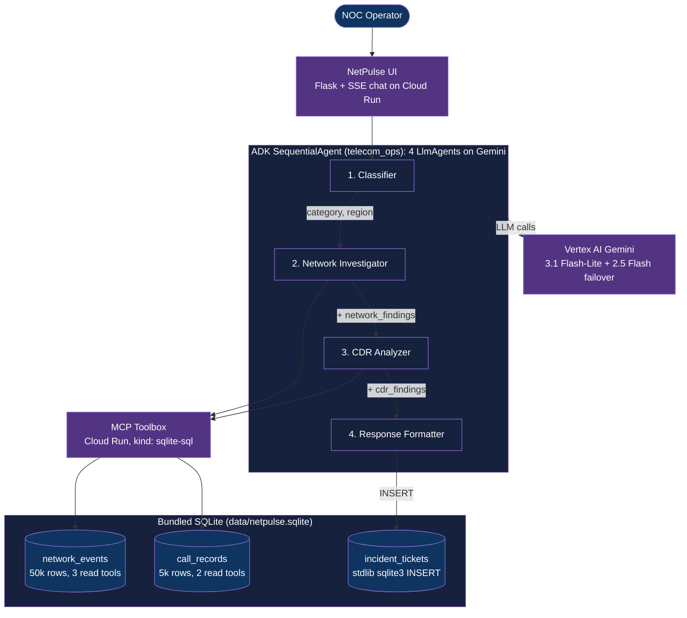
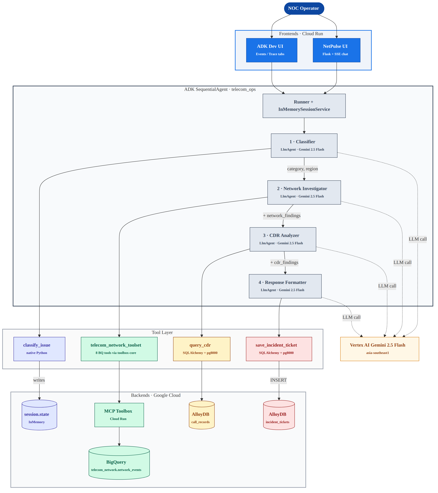

<div align="center">

# NetPulse AI: Multi-Agent Telecom Ops

[](https://www.python.org/downloads/)
[](https://google.github.io/adk-docs/)
[](https://cloud.google.com/vertex-ai)
[](LICENSE)
[](https://netpulse-ui-670100779564.asia-southeast2.run.app/)

**Multi-agent telecom ops assistant that turns a natural-language complaint into a structured incident ticket in 25 to 30 seconds**

[Features](#features) | [Architecture](#architecture) | [Demo](#demo) | [Getting Started](#getting-started) | [Deployment](#deployment)

</div>

---

## Table of Contents

- [The Problem](#the-problem)
- [Features](#features)
- [Tech Stack](#tech-stack)
- [Architecture](#architecture)
- [Demo](#demo)
- [Getting Started](#getting-started)
- [Usage](#usage)
- [How It Works](#how-it-works)
- [Architectural Decisions](#architectural-decisions)
- [Project Structure](#project-structure)
- [Deployment](#deployment)
- [License](#license)
- [Author](#author)

## The Problem

### Manual cross-system correlation in the NOC

When a customer reports something like "Major dropped calls in Surabaya", a NOC operator today has to query at least three independent systems, a network event database, a call detail records (CDR) database, and a ticketing system, then manually correlate the results dozens of times a day.

### The Solution

NetPulse AI does all of that in a single natural-language step. Built for the Gen AI Academy APAC Edition 2026 hackathon, it runs the workflow as a Google ADK `SequentialAgent` orchestrating four `LlmAgent` sub-agents, each backed by Gemini on Vertex AI. End-to-end latency is 25 to 30 seconds including all four LLM calls and three live database round-trips.

## Features

- **Multi-agent orchestration.** Four specialized ADK `LlmAgent` sub-agents chained by a `SequentialAgent`, each owning one responsibility, one tool (or one toolset), and one `output_key` written into `session.state`. Downstream agents read upstream state via defensive `{key?}` substitution so a partial chain still produces a graceful report.
- **Two parameterized SQL tools cover the CDR analyzer's prompt surface.** `query_cdr_summary(region, days_back)` returns the call_type by call_status breakdown; `query_cdr_worst_towers(region, days_back, limit)` ranks cell towers by (dropped + failed) / total. Both run as fixed-shape aggregations against the SQLite `call_records` table in under 50 ms. The agent's prompt encodes a window-mapping table ("last 7 days" maps to `days_back=7`) so dispatch is deterministic.
- **Indexed lookups on the bundled SQLite store.** `network_events` is indexed on `(region, severity, started_at)` across 50,000 events, 10 cities, and 6 months of seed data; `call_records` is indexed on `(region, call_date)`. Time-windowed scans complete in under 50 ms end-to-end. Seed data slides with `datetime.now()` so the demo never goes stale.
- **Vertex AI failover that's visible in the UI.** Every LLM call routes through `RegionFailoverGemini`, which targets the single `global` Vertex endpoint and walks a 4-attempt model ladder on `RESOURCE_EXHAUSTED` 429 or `asyncio.TimeoutError`: primary `gemini-3.1-flash-lite-preview` at a 10s timeout, then the primary again after a 0.5s sleep at 20s, then `gemini-3-flash-preview` intermediate at 20s, then `gemini-2.5-flash` GA fallback at 30s. Each model has its own quota bucket, so the GA fallback is a real escape hatch under preview-pool pressure. The chat workspace renders the walk as a per-model chip on each timeline entry, so failure shows as model-swap hops rather than a hard 500.
- **Streaming SSE chat with collapsible per-agent terminal panels.** The Flask workspace renders the agent run as a four-card vertical timeline with a terminal panel inside each card (traffic-light bar plus populated mono output below). Each panel collapses by default and expands on click. Live timer, status pill, and model-failover chip stay visible without expanding.
- **Persistent structured output.** Every run inserts an auditable row in the SQLite `incident_tickets` table with category, region, related events, CDR findings, and a NOC recommendation. AUTOINCREMENT picks up from the seed's MAX(ticket_id)+1 so agent-written rows don't collide with seeds. The workspace surfaces the saved ticket back to the operator with a category-keyed chip panel of recommended NOC actions.
- **Two frontends, one engine.** A custom NetPulse UI (Flask + SSE) for the branded demo, plus the built-in ADK Dev UI (`/events` + `/trace` tabs) for free observability. Both call the same `Runner + InMemorySessionService + root_agent`.
- **Boot-resilient by design.** The MCP Toolbox client is wrapped in `try/except` so the agent boots even when the toolbox is cold. SQLite reads from the data viewer tabs degrade to a friendly error if the file is missing rather than crashing the Flask process. The agent runner is lazy-loaded so frontend tabs that don't need the agent stay functional even if the toolbox is unreachable.
- **Validated end-to-end.** 70+ incident tickets created across 5 Indonesian regions and 3 issue categories during pre-submission and refinement-phase testing. Zero unrecovered demo failures: every preview-model 429 either clears on the same-model retry (most cases) or surfaces visibly as a model-swap chip and still produces a complete ticket.

## Tech Stack

| Component | Technology |
|---|---|
| Agent framework | Google ADK 1.14 (`SequentialAgent` + `LlmAgent`) |
| LLM | Gemini 3.1 Flash-Lite preview (primary) + Gemini 2.5 Flash (GA fallback) on Vertex AI |
| Tool gateway | MCP Toolbox for Databases (Cloud Run) |
| Data store | SQLite bundled in the container (`data/netpulse.sqlite`): 3 tables, 5 indexes |
| Driver | stdlib `sqlite3` (write path); MCP Toolbox `kind: sqlite-sql` (read path) |
| Custom UI | Flask 3 + Server-Sent Events |
| Hosting | Cloud Run (both services) |
| Auth | Application Default Credentials |

## Architecture


```mermaid
flowchart TB
    User(["NOC Operator"])
    UI["NetPulse UI<br/>Flask + SSE chat on Cloud Run"]

    subgraph ORCH["ADK SequentialAgent (telecom_ops): 4 LlmAgents on Gemini"]
        direction TB
        A1["1. Classifier"]
        A2["2. Network Investigator"]
        A3["3. CDR Analyzer"]
        A4["4. Response Formatter"]
        A1 -- "category, region" --> A2
        A2 -- "+ network_findings" --> A3
        A3 -- "+ cdr_findings" --> A4
    end

    MCP["MCP Toolbox<br/>Cloud Run, kind: sqlite-sql"]

    subgraph DATA["Bundled SQLite (data/netpulse.sqlite)"]
        direction LR
        SQ1[("network_events<br/>50k rows, 3 read tools")]
        SQ2[("call_records<br/>5k rows, 2 read tools")]
        SQ3[("incident_tickets<br/>stdlib sqlite3 INSERT")]
    end

    Vertex["Vertex AI Gemini<br/>3.1 Flash-Lite + 2.5 Flash failover"]

    User --> UI --> A1
    A2 --> MCP --> SQ1
    A3 --> MCP --> SQ2
    A4 -- "INSERT" --> SQ3
    ORCH -. "LLM calls" .-> Vertex

    style User fill:#0f3460,color:#fff
    style UI fill:#533483,color:#fff
    style A1 fill:#16213e,color:#fff
    style A2 fill:#16213e,color:#fff
    style A3 fill:#16213e,color:#fff
    style A4 fill:#16213e,color:#fff
    style MCP fill:#533483,color:#fff
    style SQ1 fill:#0f3460,color:#fff
    style SQ2 fill:#0f3460,color:#fff
    style SQ3 fill:#0f3460,color:#fff
    style Vertex fill:#533483,color:#fff
    style ORCH fill:#16213e,color:#fff,stroke:#533483
    style DATA fill:#16213e,color:#fff,stroke:#533483
```

What's load-bearing in this picture:

- **`SequentialAgent` over four `LlmAgent`s, not one big agent with four tools.** Each sub-agent owns one responsibility, one tool, and one `output_key`. Carry-over flows through `session.state`.
- **MCP Toolbox is the substrate-agnostic data gateway.** Five parameterized SQL tools (three network, two CDR) declared in `toolbox-service/tools.yaml` run against `kind: sqlite` today; flipping the source to `kind: alloydb-postgres` or `kind: bigquery` is a YAML edit with no agent-code changes. The original hackathon submission ran on the BigQuery + AlloyDB variants; the SQLite mode is a zero-idle-cost reconstitution of the same design with the agent layer untouched.
- **Vertex AI uses a model ladder at a single endpoint, not a region ladder.** Preview models are gated to specific regions per project, so the prior region ladder always 404'd on the first failover hop. Each model has its own quota bucket, so the GA fallback is a real escape hatch.
- **Async ADK Runner bridged to sync Flask via thread + queue.** The Flask SSE generator pulls from a `queue.Queue` populated by a per-request worker thread that runs its own asyncio loop. The naive `asyncio.run()` wrapper buffers events into a list before yielding, which breaks the chat-card animation.

For the full design rationale, see [`docs/LESSONS.md`](docs/LESSONS.md).

## Demo

Live on Cloud Run: **[netpulse-ui-670100779564.asia-southeast2.run.app](https://netpulse-ui-670100779564.asia-southeast2.run.app/)**

Demo video: **[youtu.be/tPrxqHku4Lw](https://youtu.be/tPrxqHku4Lw)**

Two Cloud Run services backed by a single bundled SQLite file (no managed DB). The original hackathon architecture on BigQuery + AlloyDB is one [`tools.yaml`](toolbox-service/tools.yaml) `sources:` swap away. See [Architecture](#architecture).



## Getting Started

### Prerequisites

- Python 3.12+
- A GCP project with Vertex AI enabled
- `gcloud` CLI authenticated with Application Default Credentials

### Installation

```bash
git clone https://github.com/adityonugrohoid/hackathon-telecom-ops.git
cd hackathon-telecom-ops

python3 -m venv .venv
source .venv/bin/activate
pip install -r netpulse-ui/requirements.txt

# Build the bundled SQLite store from the seed CSVs (idempotent, under 2s)
python scripts/build_sqlite.py

# Authenticate against a GCP project with Vertex AI enabled
gcloud auth application-default login
```

## Usage

Run the two services in separate terminals.

```bash
# Terminal A: MCP Toolbox over the SQLite store
# (downloads the v0.23.0 binary on first run)
scripts/run_toolbox_local.sh

# Terminal B: Flask UI
cd netpulse-ui
TOOLBOX_URL=http://127.0.0.1:5000 \
GOOGLE_CLOUD_PROJECT=<your-project> \
GOOGLE_CLOUD_LOCATION=global \
GOOGLE_GENAI_USE_VERTEXAI=TRUE \
  python app.py
```

Open `http://localhost:8080`. The workspace is at `/app`; three read-only data-viewer tabs at `/network-events`, `/call-records`, `/tickets`.

To run the ADK Dev UI (events + trace tabs) instead, run `adk web` from the repo root and select `telecom_ops`.

Bring your own data: match the contract in [`docs/SCHEMA.md`](docs/SCHEMA.md), drop your CSVs into `docs/seed-data/`, and re-run `python scripts/build_sqlite.py --recreate` to wipe and rebuild.

## How It Works

When a customer reports an issue in natural language, the `SequentialAgent` runs four sub-agents in order, each writing one `output_key` into `session.state` that the next agent reads:

1. **Classifies** the complaint into a category (network / billing / hardware / service / general) and a region.
2. **Investigates** live network events from the bundled SQLite store via MCP Toolbox.
3. **Analyzes** matching call detail records via two parameterized SQL tools served by the same MCP Toolbox.
4. **Synthesizes** an incident ticket with a NOC recommendation, persisted to SQLite and surfaced to the operator.

The five read tools are split across two toolsets in `toolbox-service/tools.yaml`:

| Toolset | Tools | Target table |
|---|---|---|
| `telecom_network_toolset` | `query_network_events`, `query_affected_customers_summary`, `weekly_outage_trend` | `network_events` |
| `cdr_toolset` | `query_cdr_summary`, `query_cdr_worst_towers` | `call_records` |

## Architectural Decisions

### 1. SequentialAgent over a single tool-heavy agent

**Decision:** Four single-responsibility `LlmAgent`s chained by a `SequentialAgent`, not one agent holding all five tools.

**Reasoning:** Each sub-agent owns one responsibility, one tool, and one `output_key`. Carry-over flows through `session.state` with defensive `{key?}` substitution, so a partial chain still produces a graceful report instead of failing the whole run.

### 2. Model ladder at a single endpoint, not a region ladder

**Decision:** Fail over across Gemini models at the single `global` Vertex endpoint rather than across regions.

**Reasoning:** Preview models are gated to specific regions per project, so a region ladder always 404'd on the first failover hop. Each model has its own quota bucket, so the GA `gemini-2.5-flash` fallback is a real escape hatch under preview-pool pressure.

### 3. MCP Toolbox as a substrate-agnostic data gateway

**Decision:** Serve all SQL through MCP Toolbox declared in `tools.yaml` rather than embedding queries in agent code.

**Reasoning:** Flipping `kind: sqlite` to `kind: alloydb-postgres` or `kind: bigquery` is a YAML edit with no agent-code changes. The SQLite mode is a zero-idle-cost reconstitution of the original BigQuery + AlloyDB hackathon design with the agent layer untouched.

### 4. Async ADK Runner bridged to sync Flask via thread + queue

**Decision:** A per-request worker thread runs its own asyncio loop and feeds a `queue.Queue` that the Flask SSE generator drains.

**Reasoning:** The naive `asyncio.run()` wrapper buffers events into a list before yielding, which breaks the chat-card animation. The thread + queue bridge preserves true streaming.

## Project Structure

```
hackathon-telecom-ops/
├── telecom_ops/             # ADK agent package (4 LlmAgents + SequentialAgent)
├── netpulse-ui/             # Flask UI + SSE chat + 3 data viewer tabs
├── toolbox-service/         # MCP Toolbox image: Go binary + tools.yaml + baked SQLite
├── scripts/                 # build_sqlite.py + deploy_toolbox.sh + run_toolbox_local.sh + seed generators
├── docs/                    # SCHEMA.md, CONFIG.md, LESSONS.md, architecture.png/.mmd
│   └── seed-data/           # Canonical CSVs (network_events, call_records, incident_tickets)
├── data/                    # Generated SQLite file (gitignored; rebuilt by scripts/build_sqlite.py)
├── static-mockup-rebuild/   # Locked design sandbox (6 HTML pages, shared CSS)
├── Dockerfile               # Cloud Run image for netpulse-ui (parent-level so both packages get copied)
├── CLAUDE.md                # Project context for AI assistants
└── README.md
```

## Deployment

Both services run on Cloud Run. SQLite is baked into each image at build time, so cold starts have data immediately and the runtime never reaches outside the container except to Vertex AI.

```bash
# 1. Toolbox: scripts/deploy_toolbox.sh rebuilds SQLite from CSVs, stages
#    it into the build context, deploys, and cleans up via trap. The script
#    resolves PROJECT_ID from $PROJECT_ID or the active gcloud config.
scripts/deploy_toolbox.sh asia-southeast2
# Capture the printed Service URL, needed for step 2 as TOOLBOX_URL.

# 2. UI: the root Dockerfile re-bakes data/netpulse.sqlite during
#    `pip install` so the Flask container has its own copy for the
#    data-viewer tabs and the save_incident_ticket write path.
gcloud run deploy netpulse-ui \
  --source . \
  --project <your-project> \
  --region asia-southeast2 \
  --allow-unauthenticated \
  --max-instances=10 \
  --cpu-boost \
  --set-env-vars=GOOGLE_CLOUD_PROJECT=<your-project>,GOOGLE_CLOUD_LOCATION=global,GOOGLE_GENAI_USE_VERTEXAI=TRUE,TOOLBOX_URL=<toolbox-url-from-step-1>
```

Scale-to-zero is intentional: no `--min-instances`, no `--no-cpu-throttling`. The only paid runtime line item is Vertex Gemini per query (about $0.001/run on Flash-Lite); Cloud Run and Artifact Registry sit inside the free tier for demo cadence. Cold starts are 2 to 3 s; warm with a `curl` 30 s before a live demo if first-question latency matters.

Tickets written by the agent persist for the container instance's lifetime. Cloud Run scale-to-zero loses them across cold starts, which is acceptable for the demo, not for production. The fix is a one-line `tools.yaml` substrate swap to a durable backend; see [Architecture](#architecture).

## License

This project is licensed under the [MIT License](LICENSE).

## Author

**Adityo Nugroho** ([@adityonugrohoid](https://github.com/adityonugrohoid))
